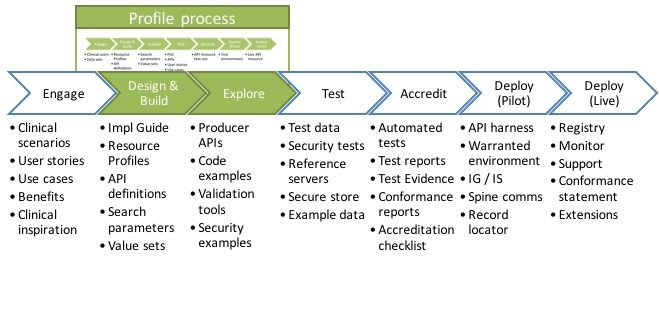
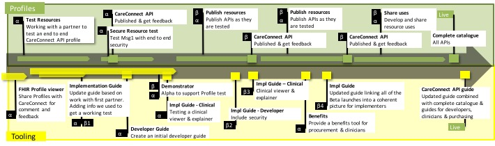





# Introduction #

The Care Connect RESTful APIs within this site have been developed collaboratively by NHS Digital and the INTEROPen community. These APIs aim to  better support the delivery of care by opening up information and data held across different clinical care settings through the use of nationally defined INTEROPen FHIR® resources. 

The INTEROPen vision is to create a library of nationally defined HL7® FHIR® resources and interaction patterns that implementers can adopt to simplify integration and interoperability within UK health and social care.

Find out more on the [INTEROPen website](http://interopen.org/).

# The Care Connect Developer Ecosystem #

This site is broadly structured around a typical API Developer's Journey. The current site is concentrated on the green boxes higlighted below in the developer journey:

 

NHS Digital is contributing to progressing the profile developmenet and testing process and invitations are open for the INTEROPen community to get involved and progress the wider developer ecosystem.

# Resource Roadmap #

The [Care Connect API roadmap](design_development_roadmap.html) outlines the resource development roadmap schedule for the RESTful APIs outlined within this site.

The above roadmap illustrates the steps necessary to create, test and verify the profiles as well as some of the supporting tooling which might be necessary to build to provide viable APIs. The roadmap is not intended to be complete but to promote discussion, extension and engagement from the INTEROPen community.
